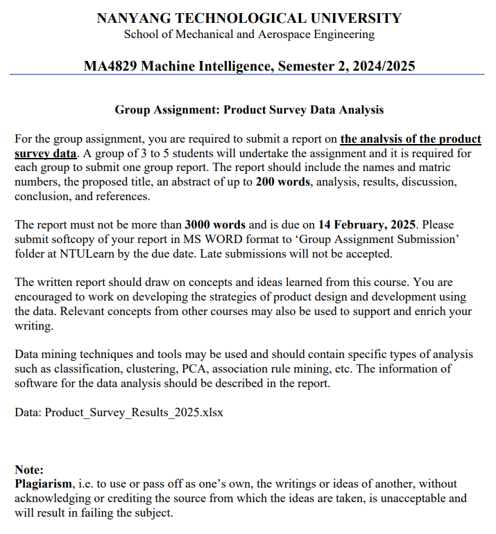

# Data Mining for Vehicle Product Survey 

Description : This repository is dedicated for a project titled "Data Mining for Vehicle Product Survey" from the module (MA4829) Machine Intelligence. The graph plotted from Rstudio thoruhg the `Data_Analysis.R` is downloaded and placed inside the figma mindmap below. Please refer to the mindmap below to view my analysis.

### The question

### Figma mindmap to consolidate my analysis 

My analysis is carried out using figma, and I enjoy using mindmap to connect the dots together. All the images you see in the figma mindmap below are generated from `Data_Analysis.R`.

https://www.figma.com/board/JKtEROQrTCi1ukKFlBPvMY/MA4829-Machine-Intelligence?node-id=0-1&t=2WxquFhFpehvsN31-1

Content : 
1. Assignmenet_Question.png -> The assignemnet question
2. Data_Analysis.R -> used mainly for graph plotting
3. Data_cleaning.ipynb -> data transformation process and data cleaning
4. Product_Survey_Results_2025.csv -> raw data
5. Product_Survey_Results_2025.csv -> (changed).csv -> transformmed data

